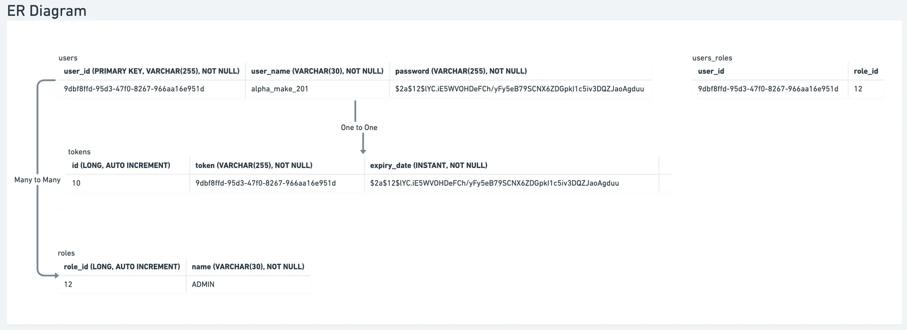
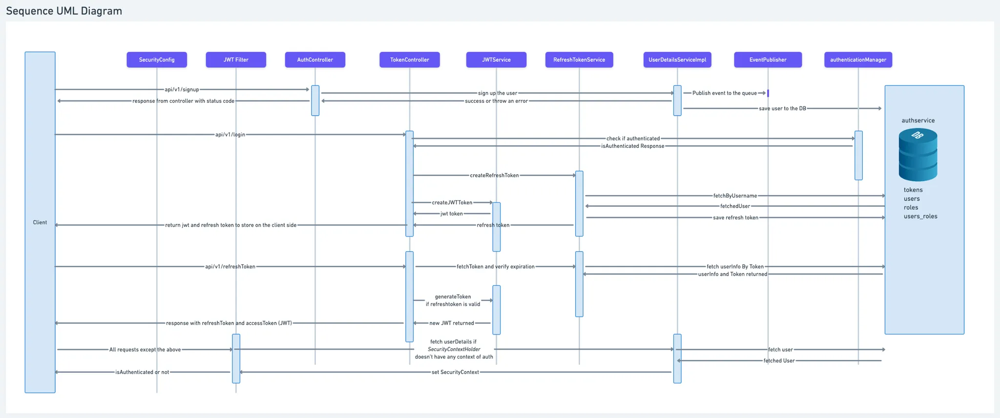
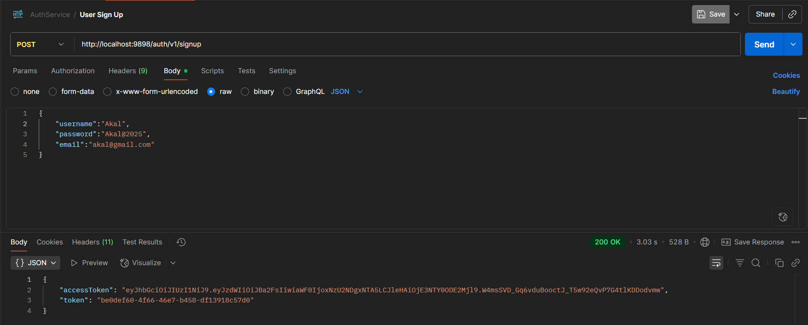
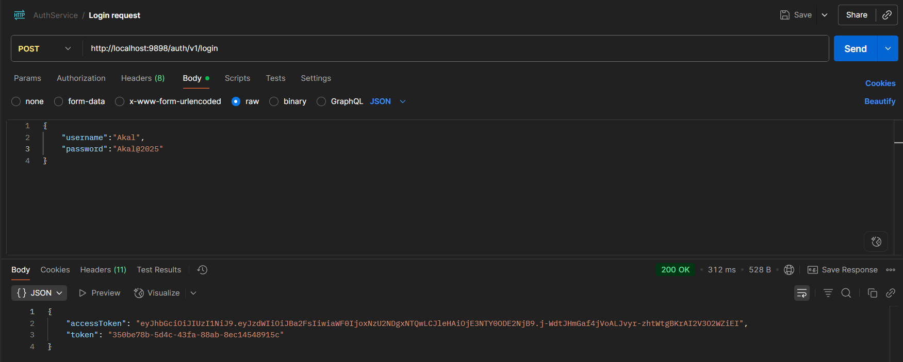

# 🔐 AuthService – JWT Based Authentication Microservice


---

## 📖 Project Overview

**AuthService** is a **Spring Boot microservice** that provides secure authentication and user management using **JWT tokens**.
It is designed as a core component of a scalable microservices ecosystem, ensuring robust and stateless authentication.

✅ Implements industry-standard **login, signup, and token generation**
✅ Backed by **MySQL database** (running in Docker)
✅ Written in **Java 21** for modern and efficient backend performance

---

## 🏗️ System Design

### ER Diagram



### Low Level Design (LLD)



---

## 🚀 Features

* 🔐 **User Authentication** (Signup, Login with JWT)
* 🔑 **Token Management** – Secure JWT generation and validation
* 🗄️ **Database Integration** with MySQL (Dockerized)
* ⚡ **REST APIs** built with Spring Boot
* 🛠️ **Clean layered architecture** (Controller → Service → Repository → Entity)

---

## 📸 Screenshots

### ✅ User Signup API



### ✅ User Login API



(Postman requests showing token generation)

---

## 🛠️ Tech Stack

* **Language:** Java 21
* **Framework:** Spring Boot , Spring Security
* **Database:** MySQL (Docker)
* **ORM:** Hibernate / JPA
* **Build Tool:** Gradle
* **Containerization:** Docker

---

## ⚡ Quick Start

### 1️⃣ Clone the Repository

```bash
git clone https://github.com/Amritpalsingh0007/AuthService.git
cd AuthService
```

### 2️⃣ Setup MySQL with Docker

```bash
docker run --name mysql-auth -e MYSQL_ROOT_PASSWORD=root -e MYSQL_DATABASE=authdb -p 3306:3306 -d mysql:8
```

### 3️⃣ Configure Database

Update `application.properties`:

```properties
spring.datasource.url=jdbc:mysql://localhost:3306/authdb
spring.datasource.username=root
spring.datasource.password=root
```

### 4️⃣ Run the Service

```bash
mvn spring-boot:run
```

### 5️⃣ Test APIs

* **Signup:** `POST http://localhost:9898/auth/v1/signup`
* **Login:** `POST http://localhost:9898/auth/v1/login`

---

## 📑 API Endpoints

| Method | Endpoint          | Description            |
| ------ | ----------------- | ---------------------- |
| POST   | `/auth/v1/signup` | Register a new user    |
| POST   | `/auth/v1/login`  | Authenticate & get JWT |

### Example – Login Request

```json
{
  "username": "Akal",
  "password": "Akal@2025"
}
```

### Example – Login Response

```json
{
  "accessToken": "eyJhbGciOiJIUzI1NiJ9...",
  "token": "350be78b-5d4c-43fa-88ab-8ec14548915c"
}
```

---

## 🎯 Why This Project Matters

* Built with **enterprise-grade architecture** and **Spring Security best practices**
* Demonstrates **real-world authentication workflows** (JWT, DB persistence)
* Showcases **backend engineering + database design** skills
* Designed for **microservice ecosystems** (can plug into larger systems)

---

## 🔮 Future Improvements

* Add **Role-Based Access Control (RBAC)**
* Implement **Refresh Tokens & Token Revocation**
* Integrate with **API Gateway** for microservice security
* Add **unit & integration tests (JUnit + Mockito)**

---

## 👨‍💻 Author

Made with ❤️ by **Amritpal Singh**

* 🌐 [GitHub](https://github.com/Amritpalsingh0007)
* 💼 [LinkedIn](https://www.linkedin.com/in/jatamritpalsingh/)
